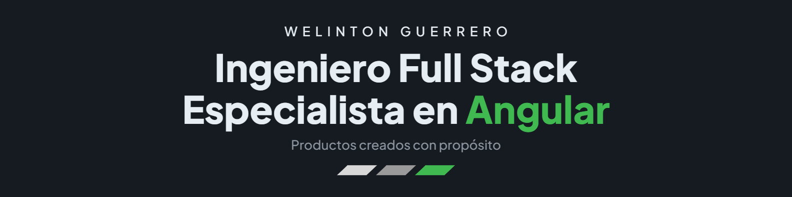

  <a href="./README.md">English</a> · <strong>Español</strong>

  

  <strong>
    Más de 4 años construyendo productos web escalables y arquitecturas frontend mantenibles con Angular y TypeScript.
  </strong>

  📍 Manta, Ecuador
  &nbsp;·&nbsp;
  🌎 Trabajo remoto
  &nbsp;·&nbsp;
  💼 Proyectos freelance

---

<h2 align="center">Sobre mí</h2>

Soy **Ingeniero en Tecnologías de la Información** y **Full Stack Engineer orientado a producto**, especializado en **Angular y TypeScript**. Diseño aplicaciones escalables, arquitecturas frontend, librerías de componentes y flujos reactivos que convierten lógica de negocio compleja en experiencias claras y mantenibles.

Actualmente trabajo en **ZGames Technology**, desarrollando productos transaccionales y de **iGaming**, integraciones con proveedores externos, interfaces de usuario y servicios backend. Aunque mi principal fortaleza es Angular, trabajo con una visión **end-to-end**, desde los datos y las APIs hasta la experiencia final del usuario.

- 🧱 Arquitectura Angular modular con RxJS, NgRx y Signals.
- 🧩 Sistemas de diseño, Storybook, componentes reutilizables y design tokens.
- ⚙️ APIs con Node.js, NestJS y bases de datos SQL/NoSQL.
- ✅ Testing, accesibilidad, rendimiento y automatización.

<h2 align="center">Angular y ecosistema frontend</h2>

  
  
  
  
  
  
  
  
  
  
  

<h2 align="center">Tecnologías adicionales</h2>

<h3 align="center">Frontend</h3>

  

<h3 align="center">Backend y bases de datos</h3>

  

<h3 align="center">Testing, DevOps y herramientas</h3>

  

  
    Experiencia adicional con Java, Spring Boot, PHP, Python, DigitalOcean y Hostinger.
  

<h2 align="center">Proyectos destacados en producción</h2>

  
    Productos públicos en los que he trabajado.
    Su código fuente se encuentra en repositorios privados.
  

<table>
  <tr>
    <td width="50%" valign="top">
      <h3 align="center">
        <a href="https://sorti365.com/home">Sorti365</a>
      </h3>
      

        Producto de <strong>ZGames Technology</strong> en el que participo como <strong>Full Stack Engineer</strong>, desarrollando interfaces, servicios backend, integraciones con proveedores externos y flujos transaccionales para la industria iGaming.
      

    </td>
    <td width="50%" valign="top">
      <h3 align="center">
        <a href="https://tecnoredec.com/">Tecnored Ecuador</a>
      </h3>
      

        Plataforma e-commerce y panel administrativo que desarrollé para gestionar productos, inventario, precios y promociones. Implementé la sincronización de inventario entre Microsoft SQL Server y MySQL.
      

    </td>
  </tr>
</table>

<h2 align="center">CV</h2>

  
  

<h2 align="center">Fuera del código</h2>

  Cuando no estoy desarrollando, disfruto los videojuegos, la música y pasar tiempo en la playa.

---

  <a href="mailto:guerrerozamora213@gmail.com?subject=Contacto%20desde%20GitHub"><strong>Hablemos sobre productos web, Angular o una colaboración freelance.</strong></a>

<h2 align="center">Actividad en GitHub</h2>

<h3 align="center">
  Cuenta personal ·
  <a href="https://github.com/GuerreroWelinton">@GuerreroWelinton</a>
</h3>

  

<h3 align="center">
  Cuenta profesional ·
  <a href="https://github.com/WguerreroZG">@WguerreroZG</a>
</h3>

  

  
    La actividad profesional muestra contribuciones agregadas y no revela
    nombres de repositorios, código fuente ni detalles de repositorios privados.
  

