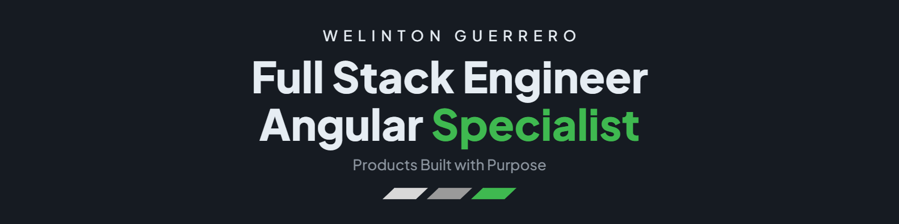

  <strong>English</strong> · <a href="./README.es.md">Español</a>

  

  <strong>
    4+ years building web products with Angular, TypeScript and Node.js.
  </strong>

  📍 Manta, Ecuador
  &nbsp;·&nbsp;
  🌎 Remote work
  &nbsp;·&nbsp;
  💼 Freelance projects

---

<h2 align="center">About me</h2>

I'm an **Information Technology Engineer** working as a **Full Stack Engineer**, mostly with **Angular, TypeScript, and Node.js**. I like building the whole picture of a product: the interfaces people use, the flows behind them, and the services that keep everything running.

I currently work at **ZGames Technology** on transactional and **iGaming** products: user interfaces, backend services, and integrations with external providers. Angular is where I feel most at home, but I enjoy working end-to-end, from the data and APIs to what the user finally sees.

- 🧱 Modular Angular architecture with RxJS, NgRx, and Signals.
- 🧩 Design systems, Storybook, reusable components, and design tokens.
- ⚙️ APIs with Node.js, NestJS, and SQL/NoSQL databases.
- ✅ Unit and component testing with Vitest, Jest, and Testing Library.
- 🚦 Performance audits with Lighthouse and CI/CD pipelines with GitHub Actions.

<h2 align="center">Angular and frontend ecosystem</h2>

  
  
  
  
  
  
  
  
  
  
  

<h2 align="center">Additional technologies</h2>

<h3 align="center">Frontend</h3>

  

<h3 align="center">Backend and databases</h3>

  

<h3 align="center">Testing, DevOps, and tools</h3>

  

  
  

  
    Additional experience with Java, Spring Boot, PHP, Python, DigitalOcean, and Hostinger.
  

<h2 align="center">Selected production projects</h2>

  
    Public products I have worked on.
    Their source code is stored in private repositories.
  

<table>
  <tr>
    <td width="50%" valign="top">
      <h3 align="center">
        <a href="https://sorti365.com/home">Sorti365</a>
      </h3>
      

        A <strong>ZGames Technology</strong> sports betting and casino portal where I work as a <strong>Full Stack Engineer</strong>. I structured the Angular frontend architecture and its reusable base components, built backend services for users, reports, bets, and transactions, and worked on <strong>sportsbook and casino integrations</strong> with external providers, validating operational and financial flows before certification and supporting them in production.
      

      

        I also build ZGames' internal management platforms: a back office and an operations dashboard.
      

    </td>
    <td width="50%" valign="top">
      <h3 align="center">
        <a href="https://tecnoredec.com/">Tecnored Ecuador</a>
      </h3>
      

        An e-commerce platform and admin panel I built end-to-end with PHP and JavaScript. I wrote a <strong>Python ETL</strong> that syncs inventory from the company's local SQL Server into MySQL without touching their legacy system, and a <strong>bulk import module</strong> connected to the Google Sheets API to create and edit products from spreadsheets. I also designed the admin interface from scratch to manage categories, brands, galleries, and promotions.
      

    </td>
  </tr>
</table>

<h2 align="center">CV</h2>

  
  

<h2 align="center">Beyond code</h2>

  When I'm not coding, I enjoy video games, music, and spending time at the beach.

---

  <a href="mailto:guerrerozamora213@gmail.com?subject=Professional%20contact%20from%20GitHub"><strong>Let's talk about web products, Angular, or a freelance collaboration.</strong></a>

<h2 align="center">GitHub activity</h2>

<h3 align="center">
  Personal account ·
  <a href="https://github.com/GuerreroWelinton">@GuerreroWelinton</a>
</h3>

  <a href="https://github.com/GuerreroWelinton">
    <picture>
      <source media="(prefers-color-scheme: dark)" srcset="./assets/metrics/personal-isocalendar-dark.svg">
      
    </picture>
  </a>

<h3 align="center">
  Professional account ·
  <a href="https://github.com/WguerreroZG">@WguerreroZG</a>
</h3>

  <a href="https://github.com/WguerreroZG">
    <picture>
      <source media="(prefers-color-scheme: dark)" srcset="./assets/metrics/work-isocalendar-dark.svg">
      
    </picture>
  </a>

  
    Professional activity is displayed using aggregated contribution data and
    does not reveal repository names, source code, or private repository details.
  

